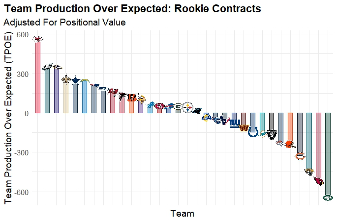

```{r setup, include=FALSE}
knitr::opts_chunk$set(echo = TRUE)
```

## Introduction

Every year, the 32 teams in the National Football League have one goal: win the Super Bowl. One of, if not the most important factor in accomplishing this goal is getting the most out of the players signed by the team. When general managers can get significant production out of players on contracts below the average pay at their position, the team can put even more talent on their roster while still staying under the league's salary cap. Players are signed to contracts in two ways: free agent contracts or through the NFL Draft. Free agent contracts are generally much more expensive than rookie contracts, but it is still possible to outperform a large contract. Drafting well is extremely important because that's where teams can generally find highly productive talent at a cheap price tag for 4 seasons, or 5 if the player was drafted in the first year and the team exercises the fifth year option embedded into all first round rookie contracts. This project will examine player production with respect to per-year contract value, adjusted for inflation, for both veteran and rookie contracts to determine which teams have built the most cost-efficient rosters since 2013.

## Limitations

There are a couple things that need to be taken into account before the results of this study are presented. The first is that not every position is able to be included. Through the `nflfastR` package, there is statistical data available for skill position players on offense, meaning quarterbacks, runningbacks, wide receivers, and tight ends, as well as all positions on the defensive side of the ball. However, there is no data available for the 5 positions along the offensive line, so they will be excluded from this study. The three primary special teams positions, kicker, punter, and long snapper, will also be excluded. No data exists for punters or long snappers, and while kicker statistics are available, looking at only one special teams position while having to exclude the others made it so looking at kickers was not necessarily worth it, not to mention the position is extremely volatile. I will also be excluding fullbacks because most teams do not have fullbacks on their roster.

Another setback with this project is an issue with the contract data when a player plays for more than one team over the duration of the contract. When this happens, the contract data frame used multiple team abbreviations with front slashes (`/`) between them. For example, Russell Wilson played for both the Seahawks and Broncos during one contract, so his team value was `SEA/DEN`. Another example is Carson Wentz, who played for the Eagles, Colts, and Commanders, in that order, during one contract. His team value in the original contract data is `IND/PHI/WAS`. The issue arises with the ordering. For the purpose of this project, I have to assign these contracts to one team, preferably the team that signed the deal, so I trim off any additional teams from that variable. However, he data frame is unfortunately inconsistent in choosing the original team as the first team in that list, so some contracts are incorrectly assigned to a team that did not directly offer the player the contract. The join operation does thankfully only consider production from the years when the player was on the team assigned to the contract. So, continuing with the prior example, the "average" production for Wentz during that contract only takes into account the year he played with the Colts.

## The Data

In order to accomplish the goals of this study, I will be utilizing three data sets found in `nflverse`, a collection of packages created by Sebastian Carl, Ben Baldwin, Lee Sharpe, Tan Ho, and John Edwards. This package contains multiple NFL data sets and a variety of tools designed to help users analyze them. The functions used to call the three data sets I will be using for this project are:

* `nflreadr::load_player_stats(seasons = TRUE, stat_type = "offense")`
  + A collection of game-by-game statistics for offensive players dating back to 1999

* `nflreadr::load_pbp(seasons=TRUE)`
  + A collection of play-by-play data for all players dating back to 1999

* `nflreadr::load_contracts()`
  + A data set of player contract data

```{r, include=FALSE}
library(nflverse)
library(dplyr)
library(tidyr)
library(ggplot2)
library(ggtext)
library(gridExtra)
thm <- theme_minimal() + theme(text = element_text(size = 14))
```

```{r, include=FALSE}
player_stats <- load_player_stats(seasons = TRUE, stat_type = "offense")
pbp <- load_pbp(seasons=TRUE)
contracts <- load_contracts()
```

### Data Manipulation

After loading those three data frames, the first thing I needed to do was compile the defensive player game statistics. There is no readily available data frame for that information, but there is a function that takes the play-by-play data and returns a data frame of game statistics for defensive players.

```{r, include=FALSE}
weekly <- calculate_player_stats_def(pbp, weekly=TRUE)
```

The next steps involve preparing the data for join operations, which required wrestling with terminology discrepancies. First, I took the defensive player data frame and added a variable that denotes whether the game listed occurred in the regular season or during the playoffs, since I will not be looking at playoff production.

```{r, include=FALSE}
weekly <- weekly %>% filter(position_group!="SPEC") %>% 
  mutate(season_type = ifelse(season <= 2020, ifelse(week <= 16, "REG", "POST"), 
                              ifelse(week <= 17, "REG", "POST")))
```

The next step was using a join operation to merge the offensive and defensive player statistics together, then using `summarise()` to produce seasonal production summaries for every player.

```{r, include=FALSE}
player_stats <- player_stats %>% mutate(team = recent_team) %>%
  full_join(weekly, by=c("player_id", "player_display_name", "position", 
                         "position_group", "team", "season","week", "season_type"),
            multiple="all") %>% filter(season_type == "REG" & position_group!="SPEC") %>%
  group_by(player_id, player_display_name, position, position_group, team, season) %>% 
  summarise(games=n(), across(completions:passing_2pt_conversions, sum),
            pacr_per_game=mean(pacr), dakota = mean(dakota),
            across(carries:receiving_2pt_conversions, sum), across(racr:wopr, mean),
            special_teams_tds = sum(special_teams_tds),
            across(def_tackles:def_penalty_yards, sum))
```

Next, I needed to prepare the contract data and the new statistics data for the join operation. I needed to merge by player name and team, since the positional terminology between the two data frames was so different for the front 7 positions on defense, which include the defensive line and linebackers. The statistical production data uses DE, DT, OLB, ILB, and a few other labels for these positions, while the contract data uses ED, IDL, and LB, which is a more accurate and scheme-independent way of labeling those players. For the contract data, I created a new variable to denote the year the contract expires, and converted the team names to abbreviations to match the statistics sheet. For both sheets, I needed to run a function that removed punctuation and suffixes from the player names to ensure that they match. I did need to build in an if statement to leave the suffix on Michael Carter II's name because there are currently two players with the name Michael Carter on the New York Jets. If the suffix was removed from his name, one of those players would have been removed from the study once the join occurred.

```{r, include=FALSE}
contracts <- contracts %>% 
  mutate(expiration = year_signed + years - 1,
         temp_team = ifelse(team=="49ers", "SF", ifelse(team=="Bears", "CHI",
                             ifelse(team=="Bengals", "CIN",
                                    ifelse(team=="Bills", "BUF",
                                           ifelse(team=="Broncos", "DEN",
                                                  ifelse(team=="Browns", "CLE",
                                                         ifelse(team=="Buccaneers", "TB",
                                                                ifelse(team=="Cardinals", "ARI",
                                                                       ifelse(team=="Chargers", "LAC",
                                                                              ifelse(team=="Chiefs", "KC",
                                                                                     ifelse(team=="Colts", "IND",
                                                                                            ifelse(team=="Commanders", "WAS",
                                                                                                   ifelse(team=="Cowboys", "DAL",
                                                                                                          ifelse(team=="Dolphins", "MIA",
                                                                                                                 ifelse(team=="Eagles", "PHI",
                                                                                                                        ifelse(team=="Falcons", "ATL",
                                                                                                                               ifelse(team=="Giants", "NYG",
                                                                                                                                      ifelse(team=="Jaguars", "JAX",
                                                                                                                                             ifelse(team=="Jets", "NYJ",
                                                                                                                                                    ifelse(team=="Lions", "DET",
                                                                                                                                                           ifelse(team=="Packers", "GB",
                                                                                                                                                                  ifelse(team=="Panthers", "CAR",
                                                                                                                                                                         ifelse(team=="Patriots", "NE",
                                                                                                                                                                                ifelse(team=="Raiders", "LV",
                                                                                                                                                                                       ifelse(team=="Rams", "LA",
                                                                                                                                                                                              ifelse(team=="Ravens", "BAL",
                                                                                                                                                                                                     ifelse(team=="Saints", "NO",
                                                                                                                                                                                                            ifelse(team=="Seahawks", "SEA",
                                                                                                                                                                                                                   ifelse(team=="Steelers", "PIT",
                                                                                                                                                                                                                          ifelse(team=="Texans", "HOU",
                                                                                                                                                                                                                                 ifelse(team=="Titans", "TEN",
                                                                                                                                                                                                                                        ifelse(team=="Vikings", "MIN", team)))))))))))))))))))))))))))))))),
         merge_team = sub("[^[:alnum:]].*", "", temp_team), merge_name = 
           ifelse(player=="Michael Carter II" & position=="CB", "Michael Carter II",
                  clean_player_names(player))) %>% filter(year_signed >= 2013) %>% 
  select(-c(is_active, player_page, date_of_birth, height, weight)) %>%
  group_by(player, position, year_signed) %>% mutate(max_value = max(value)) %>%
  ungroup() %>% filter(value == max_value)
```

The final step is the join operation. After merging the two sheets together, I grouped and summarized the data so that each row contains financial data from one contract as well as that player's average yearly production over the duration of that contract.

```{r, include=FALSE}
player_stats <- player_stats %>% mutate(merge_name = ifelse(player_display_name=="Michael Carter" & position=="CB",
                                                            "Michael Carter II", 
                                                            clean_player_names(player_display_name)),
                                        merge_team = team) %>%
  inner_join(contracts, by=c("merge_name", "merge_team"), multiple="all") %>%
  mutate(name = merge_name, team = merge_team, pos = position.y) %>%
  filter(season >= year_signed & season <= expiration) %>%
  group_by(name, team, pos, year_signed, expiration, value, apy, guaranteed, 
           apy_cap_pct, inflated_value, inflated_apy, inflated_guaranteed, college,
           draft_year, draft_round, draft_overall, draft_team) %>%
  summarize(across(games:def_penalty_yards, \(x) mean(x, na.rm=TRUE)),.groups="drop") %>%
  mutate_if(is.numeric, ~replace_na(., 0)) %>%
  mutate(experience = ifelse(year_signed==draft_year, "Rookie", "Veteran"))
```

## Teams and Logos

Throughout this project, you will see visualizations that feature the logos of all 32 NFL teams. Here is a key matching each team with its respective logo:

```{r, echo=FALSE}
afc <- ggplot(teams_colors_logos %>%
                filter((team_abbr!="LAR" & team_abbr!="OAK" & team_abbr!="SD" &
                          team_abbr!="STL") & team_conf=="AFC"), aes(x=0, y=team_abbr)) +
  geom_text(aes(label=paste0(team_name)), hjust=0) + thm + 
  theme(panel.background = element_blank(), panel.grid.major = element_blank(),
        panel.grid.minor = element_blank()) + theme(plot.title = element_text(face = "bold"),
                                                    plot.title.position = "plot",
                                                    axis.title.x = element_blank(),
                                                    axis.title.y = element_blank(),
                                                    axis.text.y = element_nfl_logo(size = 0.75),
                                                    axis.text.x = element_blank())
nfc <- ggplot(teams_colors_logos %>%
                filter((team_abbr!="LAR" & team_abbr!="OAK" & team_abbr!="SD" &
                          team_abbr!="STL") & team_conf=="NFC"), aes(x=0, y=team_abbr)) +
  geom_text(aes(label=paste0(team_name)), hjust=0) + thm + 
  theme(panel.background = element_blank(), panel.grid.major = element_blank(),
        panel.grid.minor = element_blank()) + theme(plot.title = element_text(face = "bold"),
                                                    plot.title.position = "plot",
                                                    axis.title.x = element_blank(),
                                                    axis.title.y = element_blank(),
                                                    axis.text.y = element_nfl_logo(size = 0.75),
                                                    axis.text.x = element_blank())
grid.arrange(afc, nfc, ncol=2)
```

## Contract Distributions

As mentioned in the introduction, veteran contracts on are on average more expensive for teams than rookie contracts.

```{r, echo=FALSE}
ggplot(player_stats %>% filter(pos=="QB" | pos== "RB" | pos=="WR" | pos=="TE")) +
  geom_density(aes(x=inflated_apy, color=experience), lwd=1) + facet_wrap(~ pos) +
  scale_color_manual(values = c(Rookie = "#D50A0A", Veteran = "#013369")) + thm + labs(title="Offensive Contract Distributions")

ggplot(player_stats %>% filter(pos=="ED" | pos== "IDL" | pos=="LB" | pos=="CB" | pos=="S")) +
  geom_density(aes(x=inflated_apy, color=experience), lwd=1) + facet_wrap(~ pos) +
  scale_color_manual(values = c(Rookie = "#D50A0A", Veteran = "#013369")) + thm + labs(title="Defensive Contract Distributions")
```

Judging by the density charts above, both the veteran and rookie contract distributions for every position are very heavily skewed to the right, since there is only so much money to go around. It can also be seen that although both rookies and veterans are for the most part not being paid large contracts, the veterans have a higher concentration of larger contracts across all positions than the rookie contracts, as well as having a much lower density of extreme low-end contracts. Because of this difference, I will be examining rookie and veteran contracts separately.

## Offense

For players on the offensive side of the ball, the `player_stats` data frame I pulled from the `nflfastR` package contains different variations of the metric "EPA", or "Expected Points Added". This is a very well respected metric within the football analytics community that aims to predict how much value is brought to a team's scoring probability based on contextual factors. The data frame contains versions of this metric for passing, rushing, and receiving, which covers all of the bases needed for this study. In the following sections, I will be plotting the residuals of a linear model relating a player's average yearly salary, adjusted for inflation, to their average yearly EPA, and totaling those values by team to find a team's average yearly Expected Points Over Projected, or `epop`.

### Quarterbacks

```{r, include=FALSE}
QB <- player_stats %>% filter(pos=="QB" & experience=="Veteran") %>%
  select(name:expiration, inflated_value, inflated_apy,
         games:dakota, rushing_epa) %>% mutate(qb_epa = passing_epa + rushing_epa)
QB_rookie <- player_stats %>% filter(pos=="QB" & experience=="Rookie") %>%
  select(name:expiration, inflated_value, inflated_apy,
         games:dakota, rushing_epa) %>% mutate(qb_epa = passing_epa + rushing_epa)
```

Quarterbacks are primarily responsible for passing the ball to other players on the offense, but they can also add value by running the ball. To account for this, I combined both the passing and running EPA values for quarterbacks to create a `qb_epa` variable, which I used in place of `passing_epa` when creating the models for veteran and rookie QBs. As an example of what these models would look like as a scatterplot, here is the data for rookie QBs visualized with a linear trend line representing the model:

```{r, echo=FALSE}
ggplot(QB_rookie, aes(x=inflated_apy, y=qb_epa)) + geom_nfl_logos(aes(team_abbr = team), width = 0.045, alpha = 0.7) + geom_smooth(method="lm") + thm + labs(title="Rookie Quarterback APY vs. EPA", x="Average Yearly Salary (Adjusted for Inflation)", y="Expected Points Added") + thm
```

Before officially calculating the residuals, the scatterplot reveals that the Kansas City Chiefs, Baltimore Ravens, and Philadelphia Eagles are likely to have high team residuals due to clear standout players, being Patrick Mahomes, Lamar Jackson, and Jalen Hurts respectively.

To prepare the residual data for plotting, I set up the linear model, saved the residuals as a separate column of data, and merged that column to the original data frame.

```{r, echo=FALSE}
qb_epa_mod <- lm(QB$qb_epa ~ QB$inflated_apy)
qb.epop <- resid(qb_epa_mod)
QB <- cbind(QB, qb.epop) %>% group_by(team) %>% summarise(qb.epop = sum(qb.epop))

r_qb_epa_mod <- lm(QB_rookie$qb_epa ~ QB_rookie$inflated_apy)
r_qb.epop <- resid(r_qb_epa_mod)
QB_rookie <- cbind(QB_rookie, r_qb.epop) %>% group_by(team) %>% summarise(r_qb.epop = sum(r_qb.epop))
```

The final step is plotting the residuals, which represent the aforementioned Expected Points Over Projected variable.

```{r, echo=FALSE}
ggplot(QB_rookie, aes(x=reorder(team, -r_qb.epop), y=r_qb.epop)) +
  geom_col(aes(color=team, fill=team), width=0.5) +
  geom_nfl_logos(aes(team_abbr = team), width = 0.04) +
  scale_color_nfl(type="primary") +
  scale_fill_nfl(alpha=0.4) + thm + theme(plot.title = element_text(face = "bold"),
                                          plot.title.position = "plot",
                                          axis.text.x = element_blank()) +
  labs(title="Rookie Quarterback Expected Points Over Projected", x="Team",
       y="Expected Points Over Projected (EPOP)")
```

As was suggested by the scatterplot, the Chiefs, Eagles, and Ravens do have the highest total team `EPOP` values for quarterbacks on rookie contracts. This process now needs to be repeated for veteran QBs. Now that I have displayed the process for setting up the residual plot, from this point forward I will only be showing the end result in the interest of keeping this as brief as possible.

```{r, echo=FALSE}
ggplot(QB, aes(x=reorder(team, -qb.epop), y=qb.epop)) +
  geom_col(aes(color=team, fill=team), width=0.5) +
  geom_nfl_logos(aes(team_abbr = team), width = 0.04) +
  scale_color_nfl(type="primary") +
  scale_fill_nfl(alpha=0.4) + thm + theme(plot.title = element_text(face = "bold"),
                                          plot.title.position = "plot",
                                          axis.text.x = element_blank()) +
  labs(title="Veteran Quarterback Expected Points Over Projected", x="Team",
       y="Expected Points Over Projected (EPOP)")
```

The three teams getting the most value out of veteran QB contracts are the Buccaneers, Patriots, and Saints. Notably, this would be because of two players, Tom Brady for both the Patriots and Buccaneers, and Drew Brees for the Saints. Both of these players are known for accepting team-friendly contracts in order to help their team keep talent around them. Since both produce consistently, they are both, in terms of the study, expected to make more money than they do.

### Runningbacks

Similar to quarterbacks, runningbacks have more than one way to make an impact on the field. Their primary role is obviously to carry the ball on the ground, but many RBs are expected to play roles as pass catchers as well. To account for this, I combined the rushing and receiving EPA values to create `rb_epa` to use for the RB models.

```{r, echo=FALSE}
RB_rookie <- player_stats %>% filter(pos=="RB" & experience=="Rookie") %>%
  select(name:expiration, inflated_value, inflated_apy, games, carries:rushing_epa, receiving_epa) %>%
  mutate(rb_epa = rushing_epa + receiving_epa)
r_rb_epa_mod <- lm(RB_rookie$rb_epa ~ RB_rookie$inflated_apy)
r_rb.epop <- resid(r_rb_epa_mod)
RB_rookie <- cbind(RB_rookie, r_rb.epop) %>% group_by(team) %>% summarise(r_rb.epop = sum(r_rb.epop))
ggplot(RB_rookie, aes(x=reorder(team, -r_rb.epop), y=r_rb.epop)) +
  geom_col(aes(color=team, fill=team), width=0.5) +
  geom_nfl_logos(aes(team_abbr = team), width = 0.04) +
  scale_color_nfl(type="primary") +
  scale_fill_nfl(alpha=0.4) + thm + theme(plot.title = element_text(face = "bold"),
                                          plot.title.position = "plot",
                                          axis.text.x = element_blank()) +
  labs(title="Rookie Runningback Expected Points Over Projected", x="Team",
       y="Expected Points Over Projected (EPOP)")
```

Through this plot, it can be determined that the Panthers, Ravens, and Packers have had the best returns from drafting runningbacks.

```{r, echo=FALSE}
RB <- player_stats %>% filter(pos=="RB" & experience=="Veteran") %>%
  select(name:expiration, inflated_value, inflated_apy, games, carries:rushing_epa, receiving_epa) %>%
  mutate(rb_epa = rushing_epa + receiving_epa)
rb_epa_mod <- lm(RB$rb_epa ~ RB$inflated_apy)
rb.epop <- resid(rb_epa_mod)
RB <- cbind(RB, rb.epop) %>% group_by(team) %>% summarise(rb.epop = sum(rb.epop))
ggplot(RB, aes(x=reorder(team, -rb.epop), y=rb.epop)) +
  geom_col(aes(color=team, fill=team), width=0.5) +
  geom_nfl_logos(aes(team_abbr = team), width = 0.04) +
  scale_color_nfl(type="primary") +
  scale_fill_nfl(alpha=0.4) + thm + theme(plot.title = element_text(face = "bold"),
                                          plot.title.position = "plot",
                                          axis.text.x = element_blank()) +
  labs(title="Veteran Runningback Expected Points Over Projected", x="Team",
       y="Expected Points Over Projected (EPOP)")
```

As far as veteran runningbacks go, the Chiefs, Chargers, and Patriots have gotten the best returns from signing veteran runningbacks. The runningback position is not exactly the most valuable position on the field, however, which will be important later.

### Wide Receivers

For wide receivers, the primary and only prominent role they play is as pass catchers, so I simply used the `receiving_epa` variable to build the models.

```{r, echo=FALSE}
WR_rookie <- player_stats %>% filter(pos=="WR" & experience=="Rookie") %>%
  select(name:expiration, inflated_value, inflated_apy, games, receptions:wopr)
r_wr_epa_mod <- lm(WR_rookie$receiving_epa ~ WR_rookie$inflated_apy)
r_wr.epop <- resid(r_wr_epa_mod)
WR_rookie <- cbind(WR_rookie, r_wr.epop) %>% group_by(team) %>% summarise(r_wr.epop = sum(r_wr.epop))
ggplot(WR_rookie, aes(x=reorder(team, -r_wr.epop), y=r_wr.epop)) +
  geom_col(aes(color=team, fill=team), width=0.5) +
  geom_nfl_logos(aes(team_abbr = team), width = 0.04) +
  scale_color_nfl(type="primary") +
  scale_fill_nfl(alpha=0.4) + thm + theme(plot.title = element_text(face = "bold"),
                                          plot.title.position = "plot",
                                          axis.text.x = element_blank()) +
  labs(title="Rookie Wide Receiver Expected Points Over Projected", x="Team",
       y="Expected Points Over Projected (EPOP)")
```

As shown above, the New Orleans Saints have had far and away the best returns from the WRs they have drafted since 2013, with the Seahawks and Vikings coming in second and third respectively.

```{r, echo=FALSE}
WR <- player_stats %>% filter(pos=="WR" & experience=="Veteran") %>%
  select(name:expiration, inflated_value, inflated_apy, games, receptions:wopr)
wr_epa_mod <- lm(WR$receiving_epa ~ WR$inflated_apy)
wr.epop <- resid(wr_epa_mod)
WR <- cbind(WR, wr.epop) %>% group_by(team) %>% summarise(wr.epop = sum(wr.epop))
ggplot(WR, aes(x=reorder(team, -wr.epop), y=wr.epop)) +
  geom_col(aes(color=team, fill=team), width=0.5) +
  geom_nfl_logos(aes(team_abbr = team), width = 0.04) +
  scale_color_nfl(type="primary") +
  scale_fill_nfl(alpha=0.4) + thm + theme(plot.title = element_text(face = "bold"),
                                          plot.title.position = "plot",
                                          axis.text.x = element_blank()) +
  labs(title="Veteran Wide Receiver Expected Points Over Projected", x="Team",
       y="Expected Points Over Projected (EPOP)")
```

The Saints have been much less fortunate finding wide receivers in free agency, however, as the Packers, Patriots, and Chiefs have had the most success in that department.

### Tight Ends

Tight ends are an interesting discussion to have in regards to this project because they do happen to play a couple roles on the offense, one of which is receiving. The other, however, is blocking, which is not quantifiable with the information I have available to me. In order to have them included, I was only able to look at the receiving data, which means the TE model takes into account the same information as the one for wide receivers.

```{r, echo=FALSE}
TE_rookie <- player_stats %>% filter(pos=="TE" & experience=="Rookie") %>%
  select(name:expiration, inflated_value, inflated_apy, games, receptions:wopr)
r_te_epa_mod <- lm(TE_rookie$receiving_epa ~ TE_rookie$inflated_apy)
r_te.epop <- resid(r_te_epa_mod)
TE_rookie <- cbind(TE_rookie, r_te.epop) %>% group_by(team) %>% summarise(r_te.epop = sum(r_te.epop))
ggplot(TE_rookie, aes(x=reorder(team, -r_te.epop), y=r_te.epop)) +
  geom_col(aes(color=team, fill=team), width=0.5) +
  geom_nfl_logos(aes(team_abbr = team), width = 0.04) +
  scale_color_nfl(type="primary") +
  scale_fill_nfl(alpha=0.4) + thm + theme(plot.title = element_text(face = "bold"),
                                          plot.title.position = "plot",
                                          axis.text.x = element_blank()) +
  labs(title="Rookie Tight End Expected Points Over Projected", x="Team",
       y="Expected Points Over Projected (EPOP)")
```

The teams who have had the best luck drafting tight ends are the Chiefs, 49ers, and Eagles. At this point, there are some reoccurring teams in the top 3 for a lot of these position groups. The Chiefs in particular have had a very good offense for some time now, so it is not surprising to see them ranking so highly for so many positions.

```{r, echo=FALSE}
TE <- player_stats %>% filter(pos=="TE" & experience=="Veteran") %>%
  select(name:expiration, inflated_value, inflated_apy, games, receptions:wopr)
te_epa_mod <- lm(TE$receiving_epa ~ TE$inflated_apy)
te.epop <- resid(te_epa_mod)
TE <- cbind(TE, te.epop) %>% group_by(team) %>% summarise(te.epop = sum(te.epop))
ggplot(TE, aes(x=reorder(team, -te.epop), y=te.epop)) +
  geom_col(aes(color=team, fill=team), width=0.5) +
  geom_nfl_logos(aes(team_abbr = team), width = 0.04) +
  scale_color_nfl(type="primary") +
  scale_fill_nfl(alpha=0.4) + thm + theme(plot.title = element_text(face = "bold"),
                                          plot.title.position = "plot",
                                          axis.text.x = element_blank()) +
  labs(title="Veteran Tight End Expected Points Over Projected", x="Team",
       y="Expected Points Over Projected (EPOP)")
```

For veteran tight ends, the three most successful teams have been the Chiefs, the Atlanta Falcons, and the San Francisco 49ers.

## Defense

Defensive EPA does exist, but it was not present in the defensive player statistics because there is no way to assign an EPA value to individual defensive players. As a result, I needed to get creative when finding data to model for the five defensive positions being studied here. What I ended up doing is creating a variable that tracks "impact plays" from each position, which features a different combination of significant statistics for each position based on their role in the defense. All of these models will include deductions for penalty yardage due to the potential it has to hurt a defense's performance. Once I had the impact plays variable for each position, I used the same process as I did for the offensive players to find the residuals, which are labelled below as "Impact Plays  Over Expected," or "IPOE."

### Edge Defenders

For edge defenders, the model consists of tackles for loss, sacks, and QB hits, as well as the aforementioned penalty deduction.

```{r, echo=FALSE}
ED_rookie <- player_stats %>% filter(pos=="ED" & experience=="Rookie") %>%
  select(name:expiration, inflated_value, inflated_apy, games, def_tackles:def_penalty_yards) %>%
  mutate(impact = def_tackles_for_loss + def_sacks + def_qb_hits - (def_penalty_yards/10))
r_ed_impact_mod <- lm(ED_rookie$impact ~ ED_rookie$inflated_apy)
r_ed.ipoe <- resid(r_ed_impact_mod)
ED_rookie <- cbind(ED_rookie, r_ed.ipoe) %>% group_by(team) %>% summarise(r_ed.ipoe = sum(r_ed.ipoe))
ggplot(ED_rookie, aes(x=reorder(team, -r_ed.ipoe), y=r_ed.ipoe)) +
  geom_col(aes(color=team, fill=team), width=0.5) +
  geom_nfl_logos(aes(team_abbr = team), width = 0.04) +
  scale_color_nfl(type="primary") +
  scale_fill_nfl(alpha=0.4) + thm + theme(plot.title = element_text(face = "bold"),
                                          plot.title.position = "plot",
                                          axis.text.x = element_blank()) +
  labs(title="Rookie EDGE Impact Plays Over Expected", x="Team",
       y="Impact Plays Over Expected (IPOE)")
```

The three teams who have seen the best returns on drafted edge defenders are the Steelers, Vikings, and Lions-

```{r, echo=FALSE}
ED <- player_stats %>% filter(pos=="ED" & experience=="Veteran") %>%
  select(name:expiration, inflated_value, inflated_apy, games, def_tackles:def_penalty_yards) %>%
  mutate(impact = def_tackles_for_loss + def_sacks + def_qb_hits - (def_penalty_yards/10))
ed_impact_mod <- lm(ED$impact ~ ED$inflated_apy)
ed.ipoe <- resid(ed_impact_mod)
ED <- cbind(ED, ed.ipoe) %>% group_by(team) %>% summarise(ed.ipoe = sum(ed.ipoe))
ggplot(ED, aes(x=reorder(team, -ed.ipoe), y=ed.ipoe)) +
  geom_col(aes(color=team, fill=team), width=0.5) +
  geom_nfl_logos(aes(team_abbr = team), width = 0.04) +
  scale_color_nfl(type="primary") +
  scale_fill_nfl(alpha=0.4) + thm + theme(plot.title = element_text(face = "bold"),
                                          plot.title.position = "plot",
                                          axis.text.x = element_blank()) +
  labs(title="Veteran EDGE Impact Plays Over Expected", x="Team",
       y="Impact Plays Over Expected (IPOE)")
```

-while the Saints, Panthers, and Ravens have had the most success with veteran edge defenders.

### Interior Defensive Line

Since edge defenders and interior defensive lineman play similar roles, as they are both primarily asked to rush the passer and stop the run, the two models being used are identical.

```{r, echo=FALSE}
IDL_rookie <- player_stats %>% filter(pos=="IDL" & experience=="Rookie") %>%
  select(name:expiration, inflated_value, inflated_apy, games, def_tackles:def_penalty_yards) %>%
  mutate(def_stops = def_tackles_for_loss + def_sacks + def_qb_hits - (def_penalty_yards/10))
r_idl_stops_mod <- lm(IDL_rookie$def_stops ~ IDL_rookie$inflated_apy)
r_idl.ipoe <- resid(r_idl_stops_mod)
IDL_rookie <- cbind(IDL_rookie, r_idl.ipoe) %>% group_by(team) %>% summarise(r_idl.ipoe = sum(r_idl.ipoe))
ggplot(IDL_rookie, aes(x=reorder(team, -r_idl.ipoe), y=r_idl.ipoe)) +
  geom_col(aes(color=team, fill=team), width=0.5) +
  geom_nfl_logos(aes(team_abbr = team), width = 0.04) +
  scale_color_nfl(type="primary") +
  scale_fill_nfl(alpha=0.4) + thm + theme(plot.title = element_text(face = "bold"),
                                          plot.title.position = "plot",
                                          axis.text.x = element_blank()) +
  labs(title="Rookie Interior Defensive Line Impact Plays Over Expected", x="Team",
       y="Impact Plays Over Expected (IPOE)")
```

The Los Angeles Rams have had by far the most success drafting interior defensive linemen, in large part due to Aaron Donald, who has been one of the best players in the league for almost a decade. The Seahawks and Chiefs trail behind the Rams in second and third respectively.

```{r, echo=FALSE}
IDL <- player_stats %>% filter(pos=="IDL" & experience=="Veteran") %>%
  select(name:expiration, inflated_value, inflated_apy, games, def_tackles:def_penalty_yards) %>%
  mutate(impact = def_tackles_for_loss + def_sacks + def_qb_hits - (def_penalty_yards/10))
idl_impact_mod <- lm(IDL$impact ~ IDL$inflated_apy)
idl.ipoe <- resid(idl_impact_mod)
IDL <- cbind(IDL, idl.ipoe) %>% group_by(team) %>% summarise(idl.ipoe = sum(idl.ipoe))
ggplot(IDL, aes(x=reorder(team, -idl.ipoe), y=idl.ipoe)) +
  geom_col(aes(color=team, fill=team), width=0.5) +
  geom_nfl_logos(aes(team_abbr = team), width = 0.04) +
  scale_color_nfl(type="primary") +
  scale_fill_nfl(alpha=0.4) + thm + theme(plot.title = element_text(face = "bold"),
                                          plot.title.position = "plot",
                                          axis.text.x = element_blank()) +
  labs(title="Veteran Interior Defensive Line Impact Plays Over Expected", x="Team",
       y="Impact Plays Over Expected (IPOE)")
```

For veteran IDLs, the Vikings, Cardinals, and Broncos have shown to have the best track records.

### Linebackers

The model for linebackers is very similar to that of the edge defenders and interior defensive linemen, but I added passes defended since they are expected to play more of a role in pass coverage.

```{r, echo=FALSE}
LB_rookie <- player_stats %>% filter(pos=="LB" & experience=="Rookie") %>%
  select(name:expiration, inflated_value, inflated_apy, games, def_tackles:def_penalty_yards) %>%
  mutate(impact = def_tackles_for_loss + def_sacks + def_qb_hits + def_pass_defended - (def_penalty_yards/10))
r_lb_impact_mod <- lm(LB_rookie$impact ~ LB_rookie$inflated_apy)
r_lb.ipoe <- resid(r_lb_impact_mod)
LB_rookie <- cbind(LB_rookie, r_lb.ipoe) %>% group_by(team) %>% summarise(r_lb.ipoe = sum(r_lb.ipoe))
ggplot(LB_rookie, aes(x=reorder(team, -r_lb.ipoe), y=r_lb.ipoe)) +
  geom_col(aes(color=team, fill=team), width=0.5) +
  geom_nfl_logos(aes(team_abbr = team), width = 0.04) +
  scale_color_nfl(type="primary") +
  scale_fill_nfl(alpha=0.4) + thm + theme(plot.title = element_text(face = "bold"),
                                          plot.title.position = "plot",
                                          axis.text.x = element_blank()) +
  labs(title="Rookie Linebacker Impact Plays Over Expected", x="Team",
       y="Impact Plays Over Expected (IPOE)")
```

The 49ers, Falcons, and Patriots have had the most success drafting linebackers-

```{r, echo=FALSE}
LB <- player_stats %>% filter(pos=="LB" & experience=="Veteran") %>%
  select(name:expiration, inflated_value, inflated_apy, games, def_tackles:def_penalty_yards) %>%
  mutate(impact = def_tackles_for_loss + def_sacks + def_qb_hits + def_pass_defended - (def_penalty_yards/10))
lb_impact_mod <- lm(LB$impact ~ LB$inflated_apy)
lb.ipoe <- resid(lb_impact_mod)
LB <- cbind(LB, lb.ipoe) %>% group_by(team) %>% summarise(lb.ipoe = sum(lb.ipoe))
ggplot(LB, aes(x=reorder(team, -lb.ipoe), y=lb.ipoe)) +
  geom_col(aes(color=team, fill=team), width=0.5) +
  geom_nfl_logos(aes(team_abbr = team), width = 0.04) +
  scale_color_nfl(type="primary") +
  scale_fill_nfl(alpha=0.4) + thm + theme(plot.title = element_text(face = "bold"),
                                          plot.title.position = "plot",
                                          axis.text.x = element_blank()) +
  labs(title="Veteran Linebacker Impact Plays Over Expected", x="Team",
       y="Impact Plays Over Expected (IPOE)")
```

-while the Ravens, Bills, and Cardinals have had the most success signing veterans at the position.

### Cornerbacks

The models for cornerbacks and safeties are going to look much different from the previous ones. Along with the penalty deduction, cornerbacks will be graded on passes defended and interceptions, as a way to measure their production in pass coverage.

```{r, echo=FALSE}
CB_rookie <- player_stats %>% filter(pos=="CB" & experience=="Rookie") %>%
  select(name:expiration, inflated_value, inflated_apy, games, def_tackles:def_penalty_yards) %>%
  mutate(impact = def_pass_defended + def_interceptions - (def_penalty_yards/10))
r_cb_impact_mod <- lm(CB_rookie$impact ~ CB_rookie$inflated_apy)
r_cb.ipoe <- resid(r_cb_impact_mod)
CB_rookie <- cbind(CB_rookie, r_cb.ipoe) %>% group_by(team) %>% summarise(r_cb.ipoe = sum(r_cb.ipoe))
ggplot(CB_rookie, aes(x=reorder(team, -r_cb.ipoe), y=r_cb.ipoe)) +
  geom_col(aes(color=team, fill=team), width=0.5) +
  geom_nfl_logos(aes(team_abbr = team), width = 0.04) +
  scale_color_nfl(type="primary") +
  scale_fill_nfl(alpha=0.4) + thm + theme(plot.title = element_text(face = "bold"),
                                          plot.title.position = "plot",
                                          axis.text.x = element_blank()) +
  labs(title="Rookie Cornerback Impact Plays Over Expected", x="Team",
       y="Impact Plays Over Expected (IPOE)")
```

The teams who have had the most success drafting cornerbacks are the Patriots, Cowboys, and Bills.

```{r, echo=FALSE}
CB <- player_stats %>% filter(pos=="CB" & experience=="Veteran") %>%
  select(name:expiration, inflated_value, inflated_apy, games, def_tackles:def_penalty_yards) %>%
  mutate(impact = def_pass_defended + def_interceptions - (def_penalty_yards/10))
cb_impact_mod <- lm(CB$impact ~ CB$inflated_apy)
cb.ipoe <- resid(cb_impact_mod)
CB <- cbind(CB, cb.ipoe) %>% group_by(team) %>% summarise(cb.ipoe = sum(cb.ipoe))
ggplot(CB, aes(x=reorder(team, -cb.ipoe), y=cb.ipoe)) +
  geom_col(aes(color=team, fill=team), width=0.5) +
  geom_nfl_logos(aes(team_abbr = team), width = 0.04) +
  scale_color_nfl(type="primary") +
  scale_fill_nfl(alpha=0.4) + thm + theme(plot.title = element_text(face = "bold"),
                                          plot.title.position = "plot",
                                          axis.text.x = element_blank()) +
  labs(title="Veteran Cornerback Impact Plays Over Expected", x="Team",
       y="Impact Plays Over Expected (IPOE)")
```

The Steelers, Packers, and Chargers, however, have had the most success signing veteran cornerbacks.

### Safeties

Along with passes defended and interceptions, I included solo tackles in the model since safeties are expected to be the final line of defense. Those numbers can be quite high, however, so I decided to divide them by 10 so there wouldn't be too much stock put into them relative to the other values.

```{r, echo=FALSE}
S_rookie <- player_stats %>% filter(pos=="S" & experience=="Rookie") %>%
  select(name:expiration, inflated_value, inflated_apy, games, def_tackles:def_penalty_yards) %>%
  mutate(impact = def_pass_defended + def_interceptions + (def_tackles_solo/10) - (def_penalty_yards/10))
r_s_impact_mod <- lm(S_rookie$impact ~ S_rookie$inflated_apy)
r_s.ipoe <- resid(r_s_impact_mod)
S_rookie <- cbind(S_rookie, r_s.ipoe) %>% group_by(team) %>% summarise(r_s.ipoe = sum(r_s.ipoe))
ggplot(S_rookie, aes(x=reorder(team, -r_s.ipoe), y=r_s.ipoe)) +
  geom_col(aes(color=team, fill=team), width=0.5) +
  geom_nfl_logos(aes(team_abbr = team), width = 0.04) +
  scale_color_nfl(type="primary") +
  scale_fill_nfl(alpha=0.4) + thm + theme(plot.title = element_text(face = "bold"),
                                          plot.title.position = "plot",
                                          axis.text.x = element_blank()) +
  labs(title="Rookie Safety Impact Plays Over Expected", x="Team",
       y="Impact Plays Over Expected (IPOE)")
```

The teams who have had the best track record drafting safeties are the Houston Texans, the Arizona Cardinals, and the New York Giants.

```{r, echo=FALSE}
S <- player_stats %>% filter(pos=="S" & experience=="Veteran") %>%
  select(name:expiration, inflated_value, inflated_apy, games, def_tackles:def_penalty_yards) %>%
  mutate(impact = def_pass_defended + def_interceptions + (def_tackles_solo/10) - (def_penalty_yards/10))
s_impact_mod <- lm(S$impact ~ S$inflated_apy)
s.ipoe <- resid(s_impact_mod)
S <- cbind(S, s.ipoe) %>% group_by(team) %>% summarise(s.ipoe = sum(s.ipoe))
ggplot(S, aes(x=reorder(team, -s.ipoe), y=s.ipoe)) +
  geom_col(aes(color=team, fill=team), width=0.5) + scale_color_nfl(type="primary") +
  geom_nfl_logos(aes(team_abbr = team), width = 0.04) +
  scale_fill_nfl(alpha=0.4) + thm + theme(plot.title = element_text(face = "bold"),
                                          plot.title.position = "plot",
                                          axis.text.x = element_blank()) +
  labs(title="Veteran Safety Impact Plays Over Expected", x="Team",
       y="Impact Plays Over Expected (IPOE)")
```

The Raiders have a sizable gap as the best team at signing safeties, with the Vikings and Buccaneers trailing behind.

## Team Production Over Expected (TPOE)

### Basic Evaluation

Based on the plots shown above, it seems as the the Chiefs have been the most consistent team, at least on offense. However, there is a way to check to see who truly is the best team in the NFL at efficient teambuilding. The first step of this process is aggregating all of the previously calculated residuals into two separate data frames, one for veteran contracts and one for rookie contracts.

```{r, echo=FALSE}
vet_team_ranks <- QB %>% full_join(RB, by="team", multiple="all") %>%
  full_join(WR, by="team", multiple="all") %>% full_join(TE, by="team", multiple="all") %>%
  full_join(ED, by="team", multiple="all") %>% full_join(IDL, by="team", multiple="all") %>%
  full_join(LB, by="team", multiple="all") %>% full_join(CB, by="team", multiple="all") %>%
  full_join(S, by="team", multiple="all")

rookie_team_ranks <- QB_rookie %>% full_join(RB_rookie, by="team", multiple="all") %>%
  full_join(WR_rookie, by="team", multiple="all") %>%
  full_join(TE_rookie, by="team", multiple="all") %>%
  full_join(ED_rookie, by="team", multiple="all") %>%
  full_join(IDL_rookie, by="team", multiple="all") %>%
  full_join(LB_rookie, by="team", multiple="all") %>% 
  full_join(CB_rookie, by="team", multiple="all") %>%
  full_join(S_rookie, by="team", multiple="all")
```

The next step is adding up all team residuals to calculate one final metric, Team Production Over Expected, which gives a final score for how teams performed across all positions. As mentioned earlier, there are positions in football that matter more than others when predicting team success. To start, I simply added the residuals and disregarded positional value.

```{r, echo=FALSE}
simple_vet_ranks <- vet_team_ranks %>% group_by(team) %>% mutate(tpoe = sum(qb.epop:s.ipoe))
ggplot(simple_vet_ranks, aes(x=reorder(team, -tpoe), y=tpoe)) +
  geom_col(aes(color=team, fill=team), width=0.5) +
  geom_nfl_logos(aes(team_abbr = team), width = 0.04) +
  scale_color_nfl(type="primary") +
  scale_fill_nfl(alpha=0.4) + thm + theme(plot.title = element_text(face = "bold"),
                                          plot.title.position = "plot",
                                          axis.text.x = element_blank()) +
  labs(title="Team Production Over Expected: Veteran Contracts",
       subtitle="No Positional Value Adjustment", x="Team", 
       y="Team Production Over Expected (TPOE)")
```


### Positional Value Adjustment

In order to determine which positions to value over others and how much, I used values from [a chart](https://overthecap.com/positional-value-in-the-nfl) from [OverTheCap.com](https://overthecap.com/), a website that tracks NFL contract data. I used a similar process to calculate the TPOE value for these plots as I did for the previous ones, only this time I multiplied each residual by its assigned positional value.

```{r, echo=FALSE}
value_rookie_ranks <- rookie_team_ranks %>% group_by(team) %>%
  mutate(tpoe = r_qb.epop*2.94 + r_rb.epop*0.89 + r_wr.epop*1.46 + r_te.epop*0.85 +
           r_ed.ipoe*1.63 + r_idl.ipoe*1.37 + r_lb.ipoe*1.13 + r_cb.ipoe*1.23 + r_s.ipoe*1.04)

value_vet_ranks <- vet_team_ranks %>% group_by(team) %>%
  mutate(tpoe = qb.epop*2.94 + rb.epop*0.89 + wr.epop*1.46 + te.epop*0.85 + ed.ipoe*1.63 +
           idl.ipoe*1.37 + lb.ipoe*1.13 + cb.ipoe*1.23 + s.ipoe*1.04)
```

```{r, echo=FALSE}
ggplot(value_vet_ranks, aes(x=reorder(team, -tpoe), y=tpoe)) +
  geom_col(aes(color=team, fill=team), width=0.5) +
  geom_nfl_logos(aes(team_abbr = team), width = 0.04) +
  scale_color_nfl(type="primary") +
  scale_fill_nfl(alpha=0.4) + thm + theme(plot.title = element_text(face = "bold"),
                                          plot.title.position = "plot",
                                          axis.text.x = element_blank()) +
  labs(title="Team Production Over Expected: Veteran Contracts",
       subtitle="Adjusted For Positional Value", x="Team",
       y="Team Production Over Expected (TPOE)")
```



There are two interesting things to note here, one of which being the distribution of the data. Both the adjusted and unadjusted plots showed teams to have relatively uniform distributions across the board, but the unadjusted plots had a lot of teams with values very close to zero. Because of this, if nothing else, the version of the plot adjusted for positional value is simply more interesting to look at. The other note is about the two "winners" of this study, the Chiefs and the Buccaneers. In the introduction, I pointed out that the goal of NFL teams every year is to win the Super Bowl. Since 2013, when the range of this study began, both of these teams have won at least one Super Bowl. The Chiefs have won two, including this year's Super Bowl against the Philadelphia Eagles. The Buccaneers have also won one, and it ironically enough was against the Chiefs. The returns these two teams saw from the contracts they have on the books have paid off for both organizations, and have shown the rest of the league how important it is to not only allocate those resources in an efficient manner, but to be correct when you do so.
